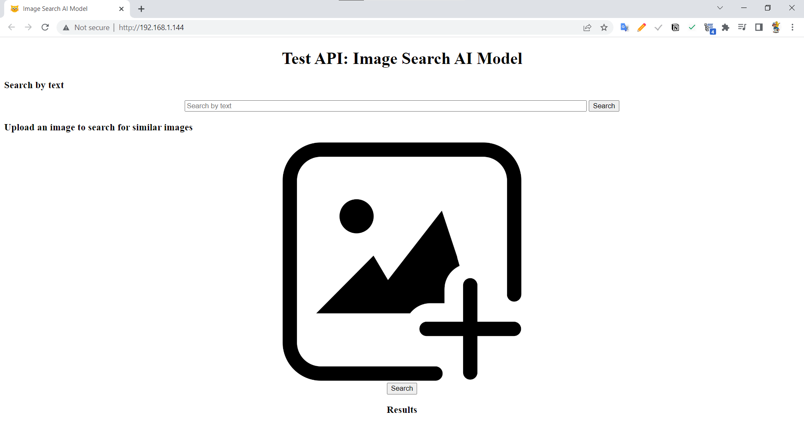

# 😼 Search Images API

## Introduction

This is a simple API that allows you to search for images using image or text.

## Requirements

- Python 3.6+
- Docker (optional)

## Setup API

1. Clone the repository

```bash
git clone https://github.com/cs300-louvre/Image-Search-AI-Model.git
```

2. Create a virtual environment

```bash
python3 -m venv env

# activate environment (windows)
env\Scripts\activate

# (Mac OS / Linux)
source env/bin/activate
```

3. Install the requirements

```bash
pip install -r requirements.txt
```

4. Run the API

```bash
python api.py --host 0.0.0.0 --port 80
```

## Usage

### Prepare data

- [images folder](images) stores the images for search.

- image types are supported: `jpg`, `jpeg`, `png`

### Search by image

```bash
curl -X POST -H 'Content-Type:application/json' -d '{"image": <base64>}' http://localhost:80/api
```

base64: Base64 encoded image

for example:

```bash
curl -X POST -H 'Content-Type:application/json' -d '{"image": "/9j/4AAQSkZJRgAB..."}' http://localhost:80/api
curl -X POST -H 'Content-Type:application/json' -d '{"image": "data:image/png;base64,/9j/4AAQSkZJRgAB..."}' http://localhost:80/api
```

### Search by text

```bash
curl -X POST -H 'Content-Type:application/json' -d '{"search_text":"a cat"}' http://localhost:80/api
```

### Web UI

This is a simple web UI that allows you to search for images using image or text.



The results are displayed.


##  Docker (optional)

### Build

```bash
docker build -t image-search-api .
```

### Run

```bash
docker run -p 80:80 image-search-api
```
